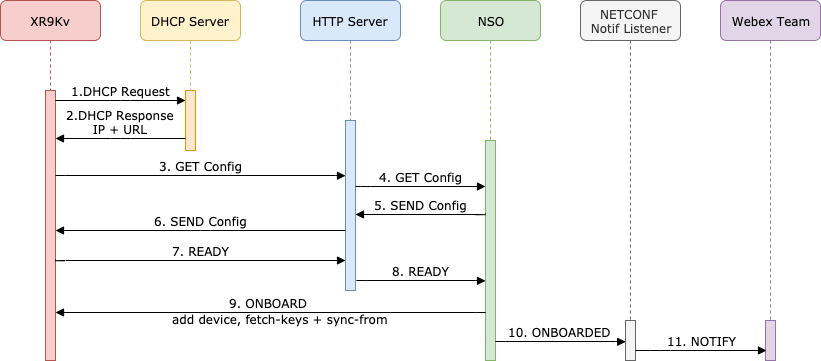

# xr-ztp-lab

_Automate IOS-XR Zero Touch Provisioning using Cisco NSO_
 
## Use Case Description

This lab comes with Jupyter lab  notebooks for showcasing a full working zero touch provisioning example for ios-xr devices. Goal is to be able to run the following call-flow:

## Installation
The lab has a corresponding [dcloud](https://dcloud.cisco.com)  where everything is installed and pre-configured. A simulated xrv9k device is used, configured and deployed inside a VIRL simulation which is also included in the dcloud environment.  

### Dependencies

- ISC DHCP server
- Python 3 
- [Ncclient](https://github.com/ncclient/ncclient) python library
- Flask python library
- Jupyter lab
- Cisco NSO
- Cisco IOS XR

## Configuration
The connection details between the different components of the lab are preconfigured inside the corresponding jupyter notebooks

## Usage

Access the lab at http://198.18.134.50:8888. Enter "cisco" for password.

Start with the [`ztp_lab`](./jupyter/ztp_lab.ipynb) notebook.
To run a section of the lab, select the cell and press `Shift+Enter`.

## Getting help

If you have questions, concerns, bug reports, etc., please create an issue against this repository.

## Getting involved

Feedback, bug fixes and feature enhancements or additions are encouraged. Please see the [CONTRIBUTING](./CONTRIBUTING.md) file for more information.

## Author(s)

This project was written and is maintained by the following individuals:

* bebeto <sbraicu@cisco.com>
